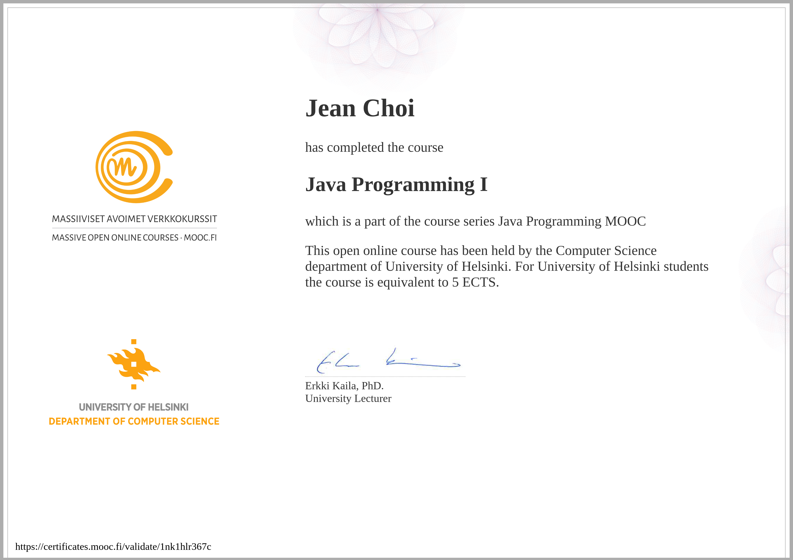

# University of Helsinki's MOOC Java Programming I
Solutions to part 1 of the University of Helsinki's MOOC Java Programming course (2013 version). All exercises for part 1 are listed.
All solutions are my own and may not be the most efficient solution. Should only be used for comparison and education
purposes. 

## Description
From the official [University of Helsinki's site: ](https://moocfi.github.io/courses/2013/programming-part-1/)

> During this course you will learn all the basics of computer programming, algorithms and object-oriented programming using the Java programming language. The course includes comprehensive course materials and plenty of programming exercises, each tested using our automatic testing service Test My Code.

This is a 2 part course. My solutions for MOOC Java Programming part 2 can be found [here](https://github.com/jeanchoi62/mooc-java-programming-ii)

